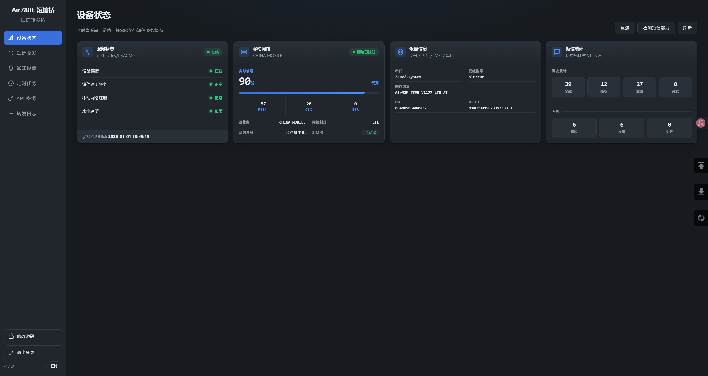

# Air780E 短信转发桥

> **[English](README.md) | 简体中文**

基于 **合宙 Air780E（4G Cat.1）模组**的短信收发 / 转发桥。通过 **USB 串口 AT 命令**与模组通信（本设备 USB ID `19d1:0001` BYD EigenComm Compo），提供 **REST API** 与 **Web 管理页面**：接收短信自动入库存档、转发到 钉钉/企业微信/飞书/Telegram/Email/Webhook，也支持发送短信与定时短信任务。

> 本项目只使用短信类 AT 命令（`AT+CMGF` / `AT+CMGS` / `AT+CMGL` / `AT+CMGD` / `AT+CNMI` / `AT+CLIP` 等），**不启用 PPP/NCM 数据拨号，不消耗 SIM 卡流量**。



## 功能亮点

- **收短信**：轮询 `AT+CMGL`（无参 = REC UNREAD）→ 去重 → 入库 SQLite（WAL）→ 按配置转发 → 逐条删除，模组/SIM 存储不保留短信
- **发短信**：REST 先入库、后台串行发送，自动切换 GSM 7bit（160 字符/条）与 UCS2（67 字符/条，中文/长短信自动分段）
- **通知转发**：钉钉 / 企业微信（群机器人）/ 飞书 / Telegram / Email，底层统一走 **Apprise**；另有独立 **Webhook HTTP 直推** 与任意 **Apprise URL** 渠道
- **定时任务**：按天间隔周期发送短信（`interval_days`），可手动立即触发
- **联系人**：号码 ↔ 名称映射，会话页直接显示姓名
- **短信网关**：可通过 REST API 调用发送/查询短信，实现自建短信网关
- **设备自愈**：断线自动重连，命令锁 + 单读者线程避免与轮询撞车
- **前端**：静态单页（状态/短信/会话/通知/密钥/任务/联系人/日志），JWT 登录、支持修改密码
- **API**：RESTful，Bearer 鉴权（管理端 JWT 或 API Key），密钥可创建/吊销（含最近使用时间）

## 快速开始

### Docker 运行

```bash
# 直接拉取镜像
docker pull ghcr.io/znhocn/air780e-bridge:latest

# 运行（把设备串口映射进容器）
docker run -d --name air780e-bridge --restart unless-stopped \
  --device /dev/ttyACM0:/dev/ttyACM0 \
  --device /dev/ttyACM1:/dev/ttyACM1 \
  --device /dev/ttyACM2:/dev/ttyACM2 \
  -p 8000:8000 \
  -e DEVICE_PORT=auto \
  -e JWT_SECRET=your-own-random-string \
  -v $(pwd)/data:/data \
  air780e-bridge:latest
```

### Docker Compose 运行（推荐）

`docker-compose.yml` 内嵌 `TZ: Asia/Shanghai`，宿主机端口 **8000** → 容器 **8000**，数据卷 `data:/data`，其余走默认值开箱即用。

```bash
# 创建目录
mkdir air780e-bridge && cd air780e-bridge/

# 下载 docker-compose.yml
wget https://github.com/znhocn/air780e-bridge/raw/refs/heads/main/docker-compose.yml

# 运行
docker compose up -d 
```

### 首次部署

打开 `http://<主机>:8000`：
- 尚无管理员时，页面引导 **创建管理员账户**（用户名 + 至少 8 位密码），成功后自动登录进入管理界面；
- 之后每次用该账户登录，管理界面携带 JWT 调用 API。

### 硬件准备（串口与 SIM）

1. 把 Air780E 串口板通过 USB 接入主机，确认枚举：

   ```bash
   lsusb   # Bus ... ID 19d1:0001 BYD EigenComm Compo
   ls /dev/ttyACM*
   ```

   本板枚举为 3 个 CDC-ACM 口（`ttyACM0/1/2`），`ttyACM0` 与 `ttyACM2` 都可作 AT 口，`ttyACM1` 为数据/诊断口。

2. 安装 udev 规则（普通用户可访问 + 标记 AT 主端口，避免 ModemManager 抢占）：

   ```bash
   sudo udevadm control --reload && sudo udevadm trigger
   sudo usermod -aG dialout $USER   # 重新登录生效
   ```

3. 插入 SIM 卡，命令行快速验证：

   ```bash
   .venv/bin/python -m app.cli status    # 应有 +CREG: 0,1(或5) 与 +CSQ 非 99
   .venv/bin/python -m app.cli probe     # 探测各串口响应
   ```

## 使用说明（管理页面）

- **状态**：连接/串口/IMEI/ICCID/SIM/运营商/信号（`CSQ` 与 dBm）/注册状态，以及今日收发与失败统计、来电统计
- **短信**：全部收发明细（含 AT 原始返回 `raw`），按号码聚合的会话视图（联系人自动显示姓名），支持搜索/分页/上翻加载
- **发送**：输入号码与内容即时发送，状态实时更新 `queued → sending → sent/failed`
- **通知设置**：逐条配置转发渠道与匹配过滤，随时「测试」推送
- **API 密钥**：创建/吊销/恢复密钥，查看最近使用时间（明文仅创建时显示一次）
- **定时任务**：周期发送（天），可手动立即触发
- **联系人**：号码 ↔ 名称 ↔ 备注
- **日志**：`/api/forward-logs` 前端展示转发结果（渠道、配置名、脱敏目标、成功与否、错误信息）
- **关于**：页面左下角显示版本号（与 `/api/version` 同源）

## REST API

参考 [API文档](docs/API.md)

### 发送示例（测试发给 10086）

```bash
curl -X POST http://localhost:8000/api/messages/send \
  -H "Authorization: Bearer <API_KEY>" -H "Content-Type: application/json" \
  -d '{"to":"10086","content":"hello"}'
```

发送为异步队列：接口返回 `{ "id": …, "status": "queued" }` 后由后台 worker 实际发送，状态后续变为 `sent` / `failed`（`raw` 字段含 AT 返回，如 `+CMS ERROR: 331` 表示无网络服务/未插 SIM）。

## 通知渠道

`type` ∈ `dingtalk` / `wecom` / `feishu` / `telegram` / `email` / `webhook` / `apprise`。`params` 必填/可选字段（在页面「通知设置」动态渲染表单）：

| type | 必填 | 可选 |
|---|---|---|
| `dingtalk` | `token` | `secret`（加签）、`phone` |
| `wecom` | `botkey`（key 或完整 Webhook 地址） | — |
| `feishu` | `token`（token 或完整 Webhook 地址） | — |
| `telegram` | `bot_token`、`chat_id`（可含 `@`） | — |
| `email` | `smtp_host`、`user`、`password`、`from`、`to` | `smtp_port`（默认 587）、`mode`（`starttls`/`ssl`） |
| `webhook` | `url` | — |
| `apprise` | `url`（任意受支持服务完整地址，如 `tgram://`、`slack://`） | — |

- 过滤：`match_from`（发件号包含子串）、`match_contains`（内容包含子串），留空 = 不限制，命中才推送
- 钉钉/企微/飞书/Telegram/Email 底层由 Apprise 发送（保存前做 URL 结构校验，界面不暴露内部 URL）；Webhook 为独立 HTTP POST（2xx 视为成功）
- 推送成功/失败均写入 `forward_logs`（渠道、配置名、脱敏目标、结果、错误）

Webhook 推送 body：

```json
{ "event": "sms", "direction": "in", "sender": "10086", "receiver": "",
  "content": "余额50元", "received_at": "2026-09-20 00:15:45" }
```

`event` 为 `sms`（短信）或 `call`（来电，内容固定 `Incoming call`）。

## 常见问题

- **`+CREG: 0,0` 无法注册 / `+CMS ERROR: 331`**：未插 SIM、SIM 松动或无信号 → 查 `AT+CPIN?`（应为 `+CPIN: READY`；`+CME ERROR: 10` 表示未插卡）。
- **无法打开串口 / ModemManager 抢口**：安装 udev 规则；必要时 `systemctl stop ModemManager`。
- **两个口都响应 AT**：`ttyACM0` 与 `ttyACM2` 均可，固定 `DEVICE_PORT` 其一，其余口勿同时占用。
- **收不到短信**：确认 `AT+CMGF=1`、`AT+CNMI=2,1,0,0,0`、SIM 可正常收短信；接收侧每 `POLL_INTERVAL` 秒轮询 `AT+CMGL`（Air780E 不支持数字枚举如 `AT+CMGL=4`）。
- **不消耗流量**：项目从不发起 `AT+CGDATA` / `AT+CGACT` / PPP，仅走短信 AT 命令。
- **忘记管理员密码**：直接操作 SQLite `UPDATE admins SET password_hash='…', salt='…' WHERE username='…'`（PBKDF2-SHA256 240000 轮，可用 `python -c "import hashlib;print(hashlib.pbkdf2_hmac('sha256',b'新密码',bytes.fromhex('盐'),240000).hex())"` 生成）。

## 技术说明

- **收短信**：每 `POLL_INTERVAL` 轮询 `AT+CMGL`（无参 = REC UNREAD；Air780E 不支持 `AT+CMGL=4`，会返回 `+CMS ERROR: 500`）→ 解析（处理引号内带逗号的时间戳、UCS2 引号包裹的正文行）→ 去重（10 分钟内同号同内容）→ 入库 `stored` → 按配置推送 → 逐条 `AT+CMGD` 删除 → 每轮后再 `AT+CMGD=1,2` 清已读/已发残留。短信与日志只存 SQLite，设备/SIM 存储不保留。
- **发短信**：按内容是否含非 ASCII 自动选 `CSCS="GSM"`（160 字符/条）或 `CSCS="UCS2"`（67 字符/条，中文/长短信自动分段），`AT+CMGS` + ctrl-Z 提交；一条锁串行发送，避免与轮询撞车。
- **状态采集**：`AT+CSQ`（信号）、`AT+CREG?`（`0`/`1`/`5`）、`AT+COPS?`、`AT+CGMM/CGMR/CGSN`、`AT+CPIN?`、`AT+CCID`，每 `STATUS_INTERVAL` 一次。
- **断线自愈**：读异常触发 `on_fatal`，worker 每 `CONNECT_RETRY_INTERVAL` 自动重连并重新握手（`AT` / `ATE0` / `AT+CMGF=1` / `AT+CSCS="UCS2"` / `AT+CNMI=2,1,0,0,0` / `AT+CLIP=1`）。
- **来电通知**：`+CLIP` 事件（120 秒内同号去重）→ 推送“来电”通知，计入 `calls_total` 统计。

## Air780E 参考文档

- [合宙Air780E模组资料中心](https://docs.openluat.com/air780e/)
- [Air780E模块AT指令手册](https://docs.openluat.com/air780e/at/app/at_command/)
- [Air780E AT固件版本](https://docs.openluat.com/air780e/at/firmware/)
- [LuaTools 下载和详细使用](https://docs.openluat.com/common/Luatools/)
